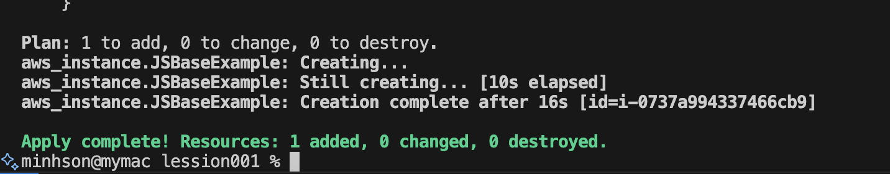

# AWS Infrastructure Project

## Prerequisites

- [Install Terraform](https://developer.hashicorp.com/terraform/install?product_intent=terraform)
- [Install AWS CLI](https://docs.aws.amazon.com/cli/latest/userguide/getting-started-install.html)

## Commands

```sh
terraform init
terraform validate
terraform plan
terraform apply --auto-approve
terraform destroy
```

## AWS

```sh
aws configure --profile test

aws_access_key_id =
aws_secret_access_key =
```


